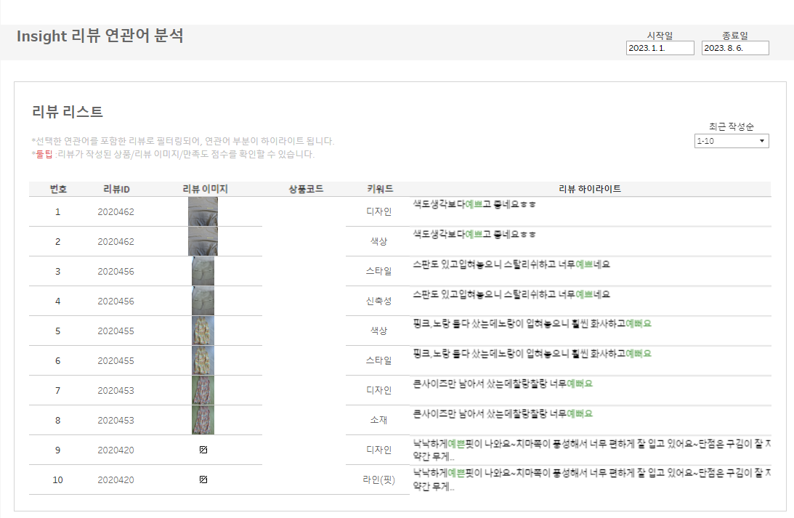

# 프로젝트 목적
power BI 대시보드에서 tableau 대시보드로 변경하여 기존 기능 구현과 신규 기능 추가


# 대시보드 주요 시트

## 키워드 분석
1. [전체 키워드 긍부정 비율]시트에 “긍정” 또는 “부정”을 클릭하면 매개변수가 선택한 값으로 바뀌도록 함
    
    
    
    
    
    선택한 값에 따라 측정값에 다른 필터를 적용하는 매개변수 : 1p_posneg_para가 선택한 값에 따라 “긍정” or “부정”이 됨  
    "경쟁" or "자사" 선택에 따라 정렬 기준이 변경됨  
    
    
    
2. 매개변수에 따라 filter측정값이 “참”이나 “거짓”으로 바뀌도록 filter측정값을 작성  
    
    
    
      
    선택 시 시트 노출 여부를 결정  
    필터 : [1p_view_fil]을 필터 참에 넣어두면 전체가 아닌 경우 필터가 작동하여 다른 차트가 보이도록 함  
    
3. filter측정값에 따라 차트가 연동됨
    
    

### 리뷰 하이라이트 노출

형태소 분석을 통해 분리한 토큰의 원형만 하이라이트 처리하기 위해 색상 변경
리뷰에서 토큰 위치를 찾아 앞 가운데 뒤 부분으로 나누어 측정값을 만들고 토큰에 해당하는 가운데 부분의 색상을 변경


  

- 측정값
- 2P_token_attr : power query 토큰 > 연관어 연산 부분
       
    ```r
    if len([Token]) = 2 then
        (CASE [Token]
        WHEN "가볍" then "가볍다" WHEN "예쁜" then "예쁘다"
        ..........................     
        WHEN "이쁨" then "예쁘다" else [Token] end)
    ELSEIF len([Token]) = 1 then
        (case [Token]
        when "크" then "크다" when "작" then "작다" when "길" then "길다" when "짧" then "짧다" else "" end)
    ELSEif len([Token]) = 3 or len([Token]) = 4  then
        (case [Token]
        when "빨라요" then "빠르다" when "가볍워서" then "가볍다" when 
        ..........................     
        "가벼워" then "가볍다" when "부드러운" then "부드럽다"
        else [Token] end)
    else [Token]
    end
    ```
    
- 2p_neg_high_loc_attr : (부정)전처리된 연관어와 매칭하기 위해 리뷰 값도 변경하고 그 후 매칭값은 일괄 “*” 로 변경
    
    ```r
    if 
    CONTAINS([리뷰],"이쁘") then REPLACE(REPLACE([리뷰], "이쁘", "예쁘"), [2p_neg_token_attr], "*")
    ELSEIF
    CONTAINS([리뷰],"이뻐") then REPLACE(REPLACE([리뷰], "이뻐", "예쁘"), [2p_neg_token_attr], "*")
    ..........................            
    else
    
    REPLACE([리뷰], [2p_neg_token_attr], "*")
    
    end
    ```
    
- 2p_pos_token_fil : 워크클라우드에서 클릭한 연관어로만 노출
    
    ```r
    if [2p_posneg_para]="긍정" then
    [긍정연관어] = [2p_pos_token_para] or [2p_pos_token_para] = "전체"
    elseif [2p_posneg_para]="부정" then
    [부정연관어] = [2p_neg_token_para] or [2p_neg_token_para] = "전체"
    else [2p_posneg_para] = "전체"
    end
    ```
    
- 2p_posneg_fil : 워드클라우드 클릭에 따라(긍정or부정) 긍정(부정)이 노출
    
    ```r
    case [2p_posneg_para]
    when "전체" then [긍부정] = [긍부정]
    when "긍정" then [긍부정] = [2p_posneg_para]
    when "부정" then [긍부정] = [2p_posneg_para]
    end
    ```
    
- 2p_neg_loc1_attr : (부정)“*” 찾은 후 나눈 앞부분
    
    ```r
    TRIM( SPLIT( [2p_neg_high_loc_attr], "*", 1 ) )
    ```
    
- 2p_neg_loc2_attr : (부정)“*” 찾은 후 나눈 뒷부분
    
    ```r
    IF TRIM( SPLIT( [2p_neg_high_loc_attr], "*", 2 ) ) = ' '
    THEN ''
    ELSE
        if RIGHT([2p_neg_high_attr],1) = LEFT(TRIM( SPLIT( [2p_neg_high_loc_attr], "*", 2 ) ),1) then
        mid(TRIM( SPLIT( [2p_neg_high_loc_attr], "*", 2 ) ),2,len(TRIM( SPLIT( [2p_neg_high_loc_attr], "*", 2 ) )))
        else
        TRIM( SPLIT( [2p_neg_high_loc_attr], "*", 2 ) ) end
    END
    ```
    
- 2p_neg_high_attr : 해서 등 제거
    
    ```r
    if [긍부정] = "부정" then
    if CONTAINS([Token],"해서") then REPLACE([Token],"해서","")
    ELSEIF  CONTAINS([Token],"해도") then REPLACE([Token],"해도","")
    ELSEIF CONTAINS([Token],"하여") then REPLACE([Token],"하여","")
    ELSEIF CONTAINS([Token],"하게") then REPLACE([Token],"하게","")
    ELSEIF CONTAINS([Token],"해요") then REPLACE([Token],"해요","")
    ELSEIF CONTAINS([Token],"한데") then REPLACE([Token],"한데","")
    else [Token]
    end
    end
    ```                                                                      
    
- 매개변수
   - 2p_pos_token_para : 클릭한 연관어
   - 2p_posneg_para : 클릭한 긍정 or 부정
- 동작 : 워드클라우드에 긍정 연관어와 부정 연관어를 클릭 시 각 선택한 값으로 매개변수 변경
   - 2p긍정연관어매개변수
   - 2p긍정연관어매개변수2
   - 2p부정연관어매개변수
   - 2p정연관어매개변수2


## 히트맵 상세
"카테고리" or "가격대" 버튼을 누르는 순서에 따라 테이블에 선택1과 선택2의 축이 추가 되고 테이블의 brand열 값들을 클릭하면 드릴다운으로 선택1의 값이 노출되고 차례로 선택1열의 값을 선택하면 선택2열의 값이 노출되도록 함


- 집계(log(키워드수)) : 키워드수가 상대적으로 작은 경우 색상 확인이 어려워 격차를 줄이고자 로그 변환
### 드릴다운 기능 : 집합 동작 기반

- 2p_price_text_dim
    
    ```r
    case [Price2] 
    when 10000 then "1만원대"
    when 20000 then "2만원대"
    when 30000 then "3만원대"
    when 40000 then "4만원대"
    when 50000 then "5만원대"
    when 60000 then "6만원대"
    when 70000 then "7만원대"
    when 80000 then "8만원대"
    when 90000 then "9만원대"
    when 100000 then "십만원 이상"
    else "1만원 이하"
    end
    ```
    
- 2p_brand_set_dim : brand 컬럼 집합
- 2p_brandset_set_dim : 선택1 컬럼 집합
- 선택1 : “카테고리” “가격대” 중 먼저 누른 컬럼 (3depth or 2p_price_text)
    
    ```r
    if [2p_brand_set_dim] then [2p_sel_dim1_attr] else "" END
    ```
    
- 2p_sel_dim1_attr : 선택1에 들어갈 컬럼
    
    ```r
    if [2p_dim1_para] = "카테고리"  and [버튼순서1] = 1  then [Depth3]
    ELSEIF [2p_dim2_para] = "가격대"  and [버튼순서2] =1  then [2p_price_text_dim]
    else ""
    end
    ```
    
- 선택2 : “카테고리” “가격대” 중 나중에 누른 컬럼 (3depth or 2p_price_text)
    
    ```r
    if [2p_brandset_set_dim] and [선택1] <> "" then [2p_sel_dim2_attr] else "" END
    ```
    
- 2p_sel_dim2_attr : 선택2에 들어갈 컬럼
    
    ```r
    if [2p_dim1_para] = "카테고리"  and [버튼순서1] = 2  then [Depth3]
    ELSEIF [2p_dim2_para] = "가격대"  and [버튼순서2] =2  then [2p_price_text_dim]
    else ""
    end
    ```
    
- 2p_sel_dim_fil : 여러 브랜드를 동시 선택하기 위한 필터
    
    ```r
    [선택2] <> ""  and [선택1] <> "" 
    or
    ([2p_dim2_para]  = "" and [2p_dim1_para] <> "") or 
    ([2p_dim1_para]  = "" and [2p_dim2_para] <> "")
    or
    [2p_dim1_para] = "" and [2p_dim2_para] = ""
    OR
    [2p_sel_dim2_para] = "전체" 
    OR
    [2p_sel_dim2_para] = ""
    or
    [2p_dim1_para] <> "" and [2p_dim2_para] <> "" and [2p_sel_dim2_para] = [선택2]
    or
    [2p_dim1_para] <> "" and [2p_dim2_para] <> "" and [2p_sel_dim1_para] = [선택1]
    or
    [2p_dim1_para] <> "" and [2p_dim2_para] <> "" and [2p_sel_dim2_para] = [선택1]
    or
    [2p_dim1_para] <> "" and [2p_dim2_para] <> "" and [2p_sel_dim1_para] = [선택2]
    ```
    
- 2p_sel_dim1_fil : 카테고리나 가격대 중 선택한 부분만 노출되도록 하는 역할, 선택1 부분
    
    ```r
    ([Depth3] = [2p_sel_dim1_para])
    OR 
    ([2p_price_text_dim] = [2p_sel_dim1_para])
    OR
    [2p_sel_dim1_para] = "전체"
    OR
    [2p_sel_dim1_para] = ""
    ```
    
- 2p_sel_dim2_fil : 카테고리나 가격대 중 선택한 부분만 노출되도록 하는 역할, 선택2 부분
    
    ```r
    ([Depth3] = [2p_sel_dim2_para])
    OR 
    ([2p_price_text_dim] = [2p_sel_dim2_para])
    OR
    [2p_sel_dim2_para] = "전체"
    OR
    [2p_sel_dim2_para] = ""
    ```
            
- 매개변수
  - 2p_dim1_para : 선택한 버튼에 따라 바뀌는 값 “카테고리” “가격대”
  - 2p_dim2_para : 선택한 버튼에 따라 바뀌는 값 “카테고리” “가격대”
  - 2p_sel_dim1_para : 카테고리 가격대의 속성값 예 바지 or 1만원대
  - 2p_sel_dim2_para : 카테고리 가격대의 속성값 예 바지 or 1만원대
- 동작
  - 2p히트맵매개변수자사 : 2p_dim1_para
  - 2p히트맵매개변수자사2 : 2p_dim2_para
  - 2p히트맵자사 : 집합 동작
  - 2p히트맵자사2 : 집합 동작

### 순서 기능 : 버튼은 누른 순서에 따라 축 순서를 바꾸는 역할

- 2p_dim1_attr : [2p_dim1_para], “카테고리” or “가격대”
- 버튼순서1 : [선택1]컬럼용
    
    ```r
    if [2p_dim1_attr] <> "" and [2p_dim2_attr] = "" then 1
    elseif [2p_dim1_attr] = "" and [2p_dim2_attr] <> "" then 2
    elseif  [2p_dim1_attr] <> "" and [2p_dim2_attr] <> "" and [버튼순서1_1] =3 and [2p_button1_para] = 0  and [2p_button2_para] = 1  then 1
    elseif  [2p_dim1_attr] <> "" and [2p_dim2_attr] <> "" and [2p_button1_para] = 0  and [2p_button2_para] = 1  then 2
    elseif  [2p_dim1_attr] <> "" and [2p_dim2_attr] <> "" and [2p_button1_para] = 3  and [2p_button2_para] = 3  then 1
    elseif  [2p_dim1_attr] <> "" and [2p_dim2_attr] <> "" and [2p_button1_para] = 0   then 2
    elseif  [2p_dim1_attr] <> "" and [2p_dim2_attr] <> "" and [2p_button1_para] = 3   then 2
    elseif  [2p_dim1_attr] <> "" and [2p_dim2_attr] <> "" and [2p_button1_para] = 1   then 1
    elseif  [2p_dim1_attr] <> "" and [2p_dim2_attr] = "" and [2p_dim1_para]<> ""  and [2p_dim2_para] <> "" then 2
    elseif  [2p_dim1_attr] = "" and [2p_dim2_attr] <> "" and [2p_dim1_para]<> ""  and [2p_dim2_para] <> "" then 1
    else 0 end
    ```
    
- 버튼순서1_1 : 2p_botton1_para에 적용
    
    ```r
    if  
    [2p_button1_para] <> 0 and [2p_button2_para] = 0 then 3
    ELSEIF  [2p_button2_para] = 0 then 1
    ELSEIF  [2p_button2_para] = 1 then 3
    end
    ```
    
- 2p_dim2_attr : [2p_dim2_para], “카테고리” or “가격대”
- 버튼순서2 : [선택2]컬럼용
    
    ```r
    if [2p_dim1_attr] = "" and [2p_dim2_attr] <> "" then 1
    elseif [2p_dim1_attr] <> "" and [2p_dim2_attr] = "" then 2
    elseif  [2p_dim1_attr] <> "" and [2p_dim2_attr] <> "" and [버튼순서1_1] =3 and [2p_button1_para] = 0  and [2p_button2_para] = 1  then 2
    elseif  [2p_dim1_attr] <> "" and [2p_dim2_attr] <> "" and [2p_button1_para] = 0  and [2p_button2_para] = 1  then 1
    elseif  [2p_dim1_attr] <> "" and [2p_dim2_attr] <> "" and [2p_button1_para] = 3  and [2p_button2_para] = 3  then 2
    elseif  [2p_dim1_attr] <> "" and [2p_dim2_attr] <> "" and [2p_button1_para] = 0   then 1
    elseif  [2p_dim1_attr] <> "" and [2p_dim2_attr] <> "" and [2p_button1_para] = 3   then 1
    elseif  [2p_dim1_attr] <> "" and [2p_dim2_attr] <> "" and [2p_button1_para] = 1   then 2
    elseif  [2p_dim1_attr] <> "" and [2p_dim2_attr] = "" and [2p_dim1_para]<> ""  and [2p_dim2_para] <> "" then 1
    elseif  [2p_dim1_attr] = "" and [2p_dim2_attr] <> "" and [2p_dim1_para]<> ""  and [2p_dim2_para] <> "" then 2
    else 0 end
    ```
    
- 버튼순서2_1 : 2p_bottom2_para에 적용
    
    ```r
    if 
    [2p_button1_para] <> 0 and [2p_button2_para] = 0 then 3
    ELSEIF  [2p_button1_para] = 0 then 1
    end
    ```
    
- 2p_button1_attr : "카테고리”, 버튼 시트에 들어감
- 2p_button2_attr : “가격대”, 버튼 시트에 들어감
- 매개변수
  - 2p_botton1_para
  - 2p_bottom2_para
- 동작
  - 2p버튼순서1 : 버튼 선택 시 [2p_botton1_para]을 [버튼순서1-1]값으로 변경
  - 2p버튼순서2 : 버튼 선택 시 [2p_botton2_para]을 [버튼순서2-1]값으로 변경
  - 2p버튼필터1 : 선택 시 2p버튼2[시트] 필터
  - 2p버튼필터2 : 선택 시 2p버튼1[시트] 필터
  - 2p선택1 매개변수 초기화 : [2p_sel_dim1_para]를 [초기화]값으로 변경
  - 2p선택1매개변수 : [2p_sel_dim1_para]를  [선택1] 값으로 변경
  - 2p선택2매개변수 초기화 : [2p_sel_dim1_para]를 [초기화]값으로 변경
  - 2p선택2매개변수 : [2p_sel_dim2_para]를  [선택2] 값으로 변경


### data-driven-parameters (2depth 필터)  

> 왜 필요하냐? 
  1depth, 2depth 카테고리 필터를 생성하여 적용이 목적인데 1depth 매개변수 생성 후 1depth에서 선택하면 2depth 매개변수에서는 1depth에서 선택한 카테고리 기준으로 필터링되어야 하나, 필터링되지 않은 모든 내역이 보임 > 해결 방법이 없어서 외부 확장프로그램을 찾음  

1. 확장 프로그램, 대시보드에서 추가 후 ▼ 클릭하여 메뉴 오픈 > 구성 클릭


2. 필터용 시트 생성 후 대시보드에 깔기, 보이는 것이 목적이 아니라면 가려서 숨김 처리 (동작을 위해 필요)

1depth,2depth 컬럼이 깔려있고, 1depth필터로 노출되는 2depth가 바뀜 


3. configure 처음 값은 1depth 매개변수 선택, 그 다음은 미리 세팅하여 대시보드에 깔아둔 시트 선택


4. options : 아래 체크 부분 동일하게 하고 1depth 매개변수 선택 및

“전체” 입력, “전체”는 미선택 시 매개 변수에 나타나는 내용으로 필터 설정 시 동일하게 입력해야함


    
    

## 측정값 명명 규칙

- 입력 예시
  - 1p_cate_fil : 1페이지 사용 코드, 카테고리 관련, `필터`
  - 1p_cate_attr : 1페이지 사용 코드, 카테고리 관련, `속성값`
  - 2p_brand_set_dim : 2페이지 사용 코드, 브랜드 관련, `축`
  - 1p_brand_para : 1페이지 사용, 브랜드 관련, `매개변수`
  - 2p히트맵매개변수 : 2페이지 사용, 히트맵 선택, `동작`
- 측정값은 보이는 이름과 같은 내용입니다.
    